# Winterburn Photography

Winterburn Photography is a website showcasing, recent work by the photographer, giving information about the packages they offer, what work they have recently done shown by a gallery, customer reviews and showing how you can get in touch. In the website the user will learn how to get in touch with the contact page, what equipment can be used and what the results look like with the gallery page, learn what packages are currently on offer with time frames with the amount of hours shown on the page in the package cards and how many photos they can choose to have, on the main index page the user will learn what the website is about and what previous customers have said about their photography experience with Winterburn Photography. [here is the website](https://rwinterburn.github.io/PP1/)

# User Stories
The purpose of the website is to encourage the user to book a photoshoot with the photographer with the contact form, show the user what the photographer has been taking pictures of with the gallery and for the user to learn a bit more about the photographer in general with the main page and show previous experience with customers with the customer reviews. The main target audience will be for people wanting a wedding shoot or headshots but other shoots can be provided.

### Project goals 

* Show information about the photographer.
* Show what the photographer has produced.
* Show different packages on offer for the user.
* Show how to get in contact with the photographer.

# UX Design

The site objectives are to showcase what Winterburn Photography can provide with a Gallery and equipment list also to show users where they can get in touch if they want any photos taken in the future and also a package list to show what different photography packages that the company has to offer. 

To achieve the websites objectives to navigate through the different pages of the website it will need a Navigation bar, I've included a Header with a clickable link to take you back to the main page aswell. The website also needs a gallery section to showcase the photographers work with an information bar underneath the gallery section to show what equipment the company has to offer. It will also need a contact form for the users to communicate directly with the owner to organise a photo shoot. Package cards will also be created to show the user what different packages the company has on offer.

The information will be displayed on the dark background elements to make it stand out from the main background image of the website.
The main design for the website will have the font color in #fff (white) and background elements in rgba(26, 24, 21, 0.733) (Dark black) to make the text stand out and be visually appealing the main body of the page will feature an image taken by the photographer to make it more streamlined for the companies purpose. The main font will be "poppins" because that is a common and nice font family. For the mobile design all content will be centered so it is an easy scrollable experience for the user and the desktop page will be more spaced out between elements so the seperate content can breathe a little. 

 # WireFrames Desktop
   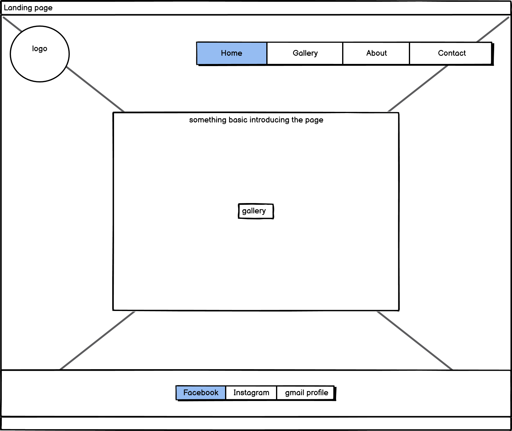
    Here is the wireframe for the main index page, it is a bit different from the final result as the website wasn't mobile friendly at the start so I modified it to make it more mobile friendly. 

   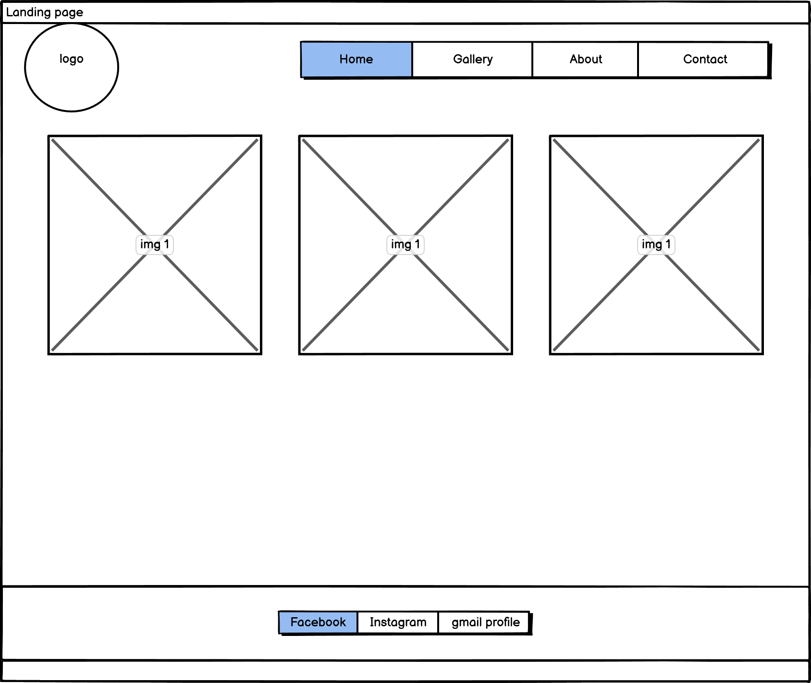
    The Gallery wireframe.

   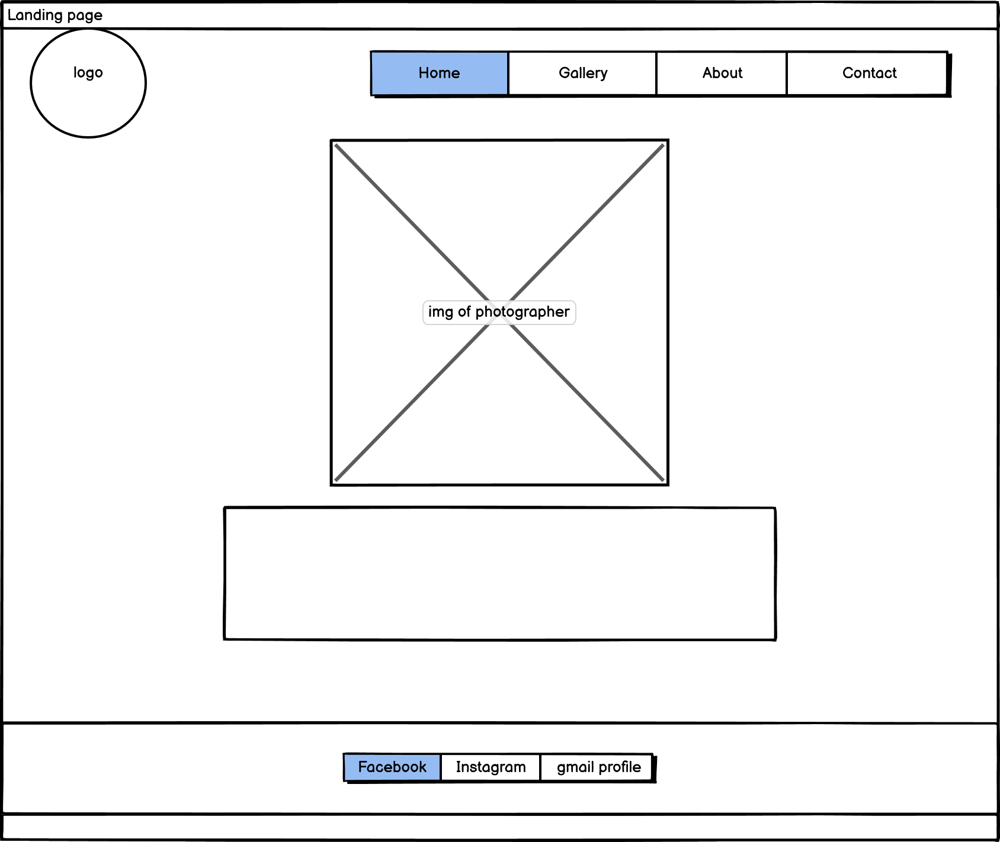
    Packages/about wireframe desktop.

   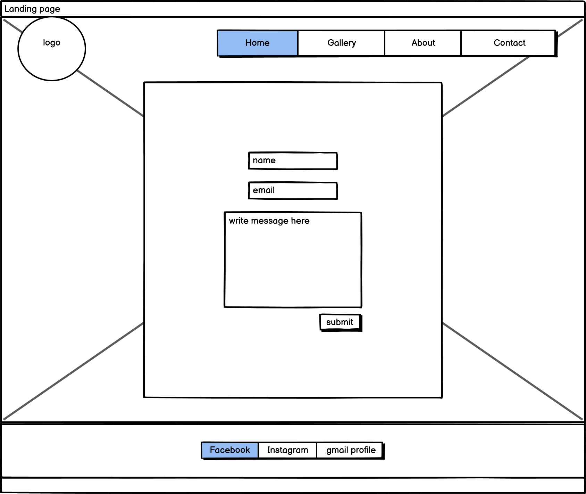
    Contact page wireframe desktop. 

# Wireframes Mobile

index page wireframe mobile.

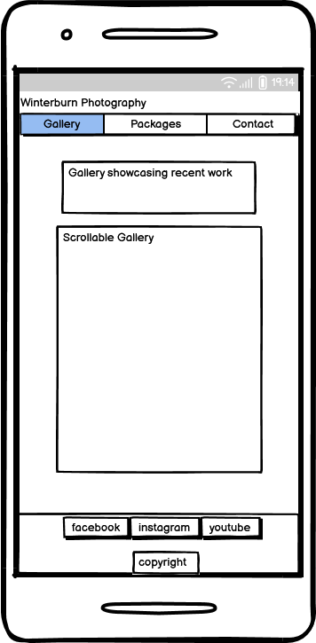
Gallery page wireframe mobile.

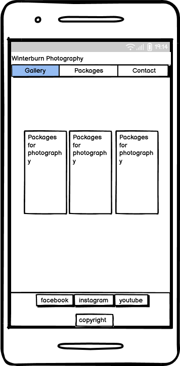
Packages page wireframe mobile.

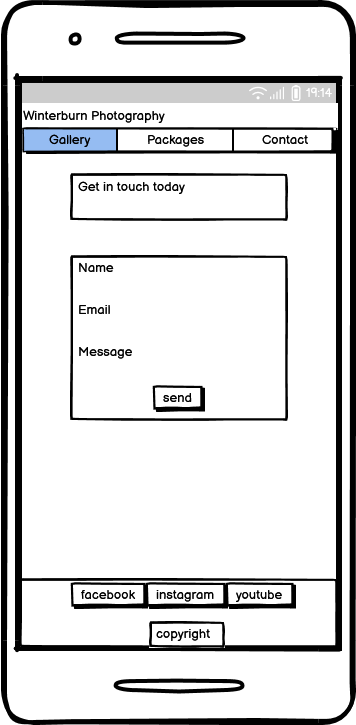
Contact page wireframe mobile.

# Features 

1. Navigation bar at the top of the webpage, to navigate around the seperate pages on the website.
   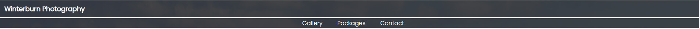
2. permanent footer at the bottom of the page to display the copyright and social media links that open up with seperate tabs using the target \_blank attribute.
   
3. A contact form to get in touch with the company including name, email and message with the form set to required so the user can't send blank messages name or invalid email address. The original structure of the form was borrowed from chat.gpt but the whole styling got changed due to aesthetic not fitting with the webpage. Responsive on different devices, Achieved by media queries.
   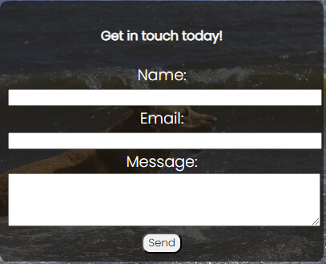
4. A gallery so the user can look at the recent images that the company has produced and encourages the user to have more incentive to get in touch with the company. The gallery is fully responsive on all devices.
   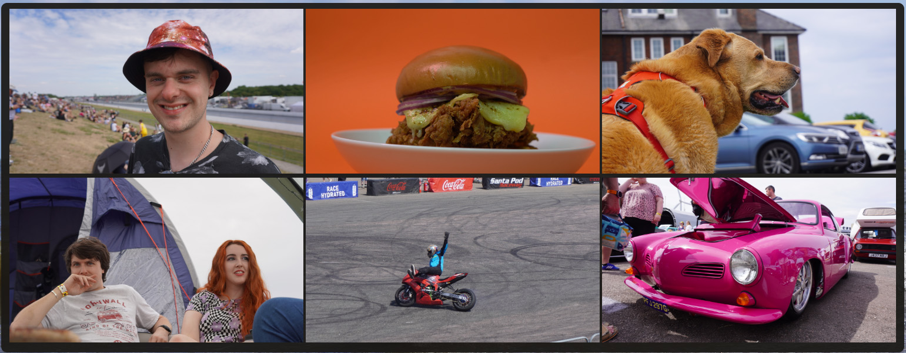

## Future features
 For the future features I would like to add a shop page to the website where the user can click on the image and buy the image from the website and for it to be printed onto a canvas.

# Technologies Used 
* Google Fonts
* Balsamiq WireFrames
* HTML 
* CSS
* VSCode
* Code Anywhere 
* Gitpod.io
* Github.com
* Git
* Font Awesome
* Am I reponsive

# Manual testing 

### Navigation Bar
To manual test the navigation bar links you will need to click on the navigation bar links and see if they take you to the right page.
* Gallery should take you to the "gallery page" where you will see the gallery and equipment list.
* Packages should take you to the "packages page" where you will see the different packages on offer for the website.
* Contact should take you to the "contact page" where you will see the contact form and contact numbers and address for the company.
* To get back to the main page you will need to click on "Winterburn Photography" in the header and that should take you back to the main page. 
* They should work on each indvidual page you click on.

### Footer links 
To manual test the footer links, you should click on the footer logos.
* The Facebook logo should take you to Facebook.
* The Instagram logo should take you to Instagram.
* The YouTube logo should take you to YouTube.

These should work for all different pages e.g. if they work on the main page they should work for the Gallery page etc.

Note that these will just take you to the landing page as there is no actual social media sites for Winterburn Photography.

### Contact Form
To manual test the contact form you will need to. 
* Go to "contact" on the navigation bar
* Fill out the form with everything filled in including a valid "@" email.
* If done correctly the form should take you to this page. 
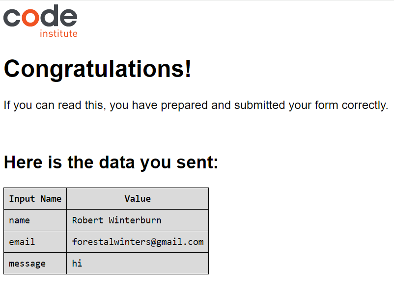

 * Try send a message without a name if it comes up with "Please fill out this field" then the form is working as it should.
  * Try send a message without an email if it comes up with "Please fill out this field" then the form is working as it should.
  * Try send a message without a message if it comes up with "Please fill out this field" then the form is working as it should.

## W3C Validation 
Managed to fix these few errors by finding the lines of code referenced on the page and removing the stray tags and correctly formating the code. Here are the results. 
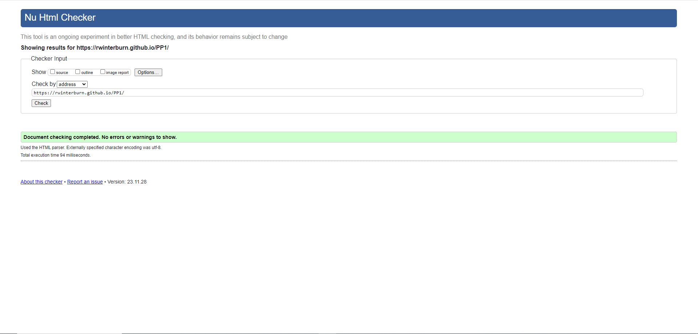

Here are the validation images for the CSS and HTML 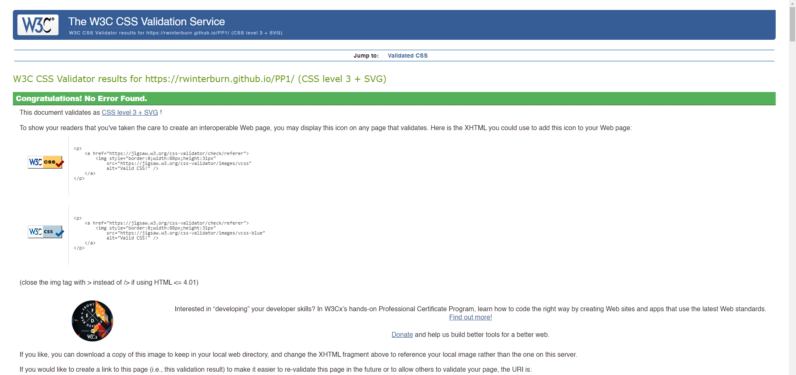
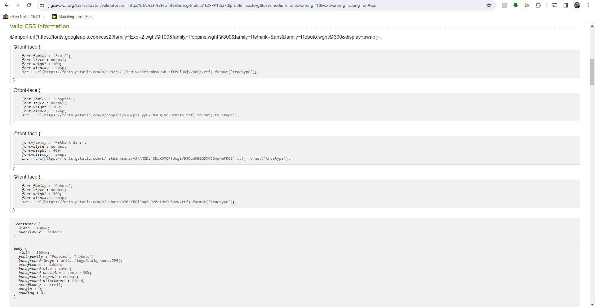 

### Am I Responsive 
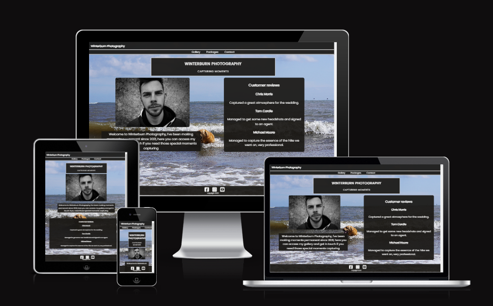

### Lighthouse Report 
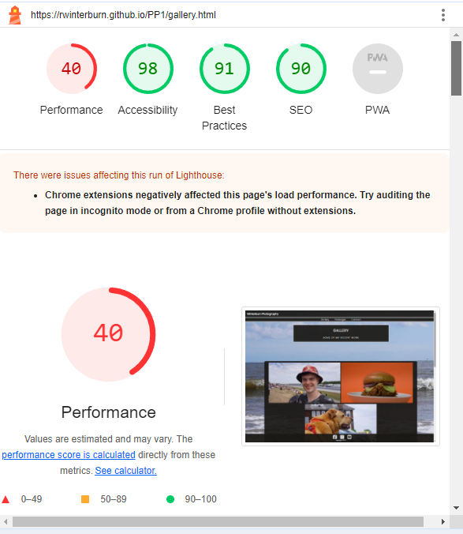
Lighthouse report looks good on everything except for performance, this will be due to the raw image sizes unfortunately but everything else looks good.

# Challenges and Bugs
The only bugs I got were unclosed elements and stray tags. Some titles weren't formatted correctly which you can see here.
At first the webpage was not valid as seen by this screenshot here 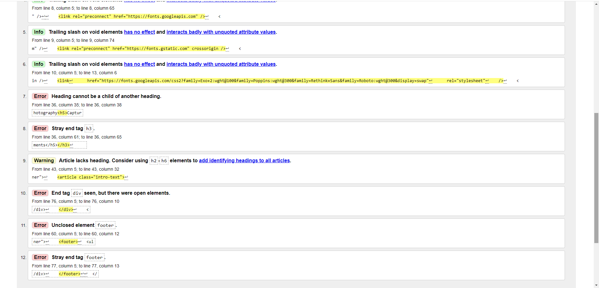

I ran into another problem on my Github, I had made a previous account called "Twinwinter" on my email address robertwinterburn@hotmail.co.uk and I had made a new account to make my name a bit more professional and readable (RWinterburn) but when I started making commits they came from "Twinwinter" on one and "RWinterburn" from another I don't know wether it was to do with me from switching from gitpod.io and codeanywhere to VScode need to figure this problem out for future developments as I haven't figured it out yet. So you will see commits from both of my Github accounts.

# Deployment and Development 

### Deployment 

To deploy the website the user must 
* Log in to Github.com.
* Go to "settings".
* Click "pages" under "codes and automation".
* Select "deploy from a branch" and select the "main" branch.
* Then select "/(root)" 
* Click "save" to save the Github page source.
* Go to "code".
* Click on the yellow circle on the page repository.
* You will see the backend working on building the website when this is complete go to "settings"
* Click "pages" 
* You should see the website link https://rwinterburn.github.io/PP1/
* Click on the link and you will see the website.

### Development 
For future development go to https://github.com/RWinterburn/PP1
* Click the green "code" button.
* Copy the URL
* Go to your cloud based coding site. e.g. Code Anywhere or Gitpod.io
* click on "new workspace". 
* Paste in the repository URL
* Click create and it will create the code space for you.

#### VSCode Development
For future development go to https://github.com/RWinterburn/PP1
* Click the green "code" button.
* Copy the URL
* Open "command palette in VSCode (CTRL + SHIFT + P)
* Click the option "Git Clone"
* Click "clone from Github"
* Paste in the Repository URL 
* Hit "Enter"
* A window will pop up on your computer asking you to choose you repository destination, choose an appropriate folder. 
* Select the repository destination and the workspace will click open. 
* You may get the option saying "Do you trust this author? click Yes"

# Tutorials Used
https://www.youtube.com/watch?v=Trw_9lisYVY&t=45s for the gallery

The HTML gallery being off center found code from https://blog.hubspot.com/website/center-div-css

Old design of scrollable gallery code was found on here https://www.w3schools.com/howto/howto_css_image_gallery_scroll.asp

Found solution for page not scrolling here https://www.quora.com/Why-cant-I-scroll-on-my-HTML-website-1#:~:text=There%20are%20a%20few%20possible%20reasons%20why%20you%20are%20not,%2Dheight'%20set%20too%20low.

Fixed background image changing on different page using "background attachment fixed" found this line of code on
https://www.w3schools.com/cssref/pr_background-position.php

Used Chat.GPT for other sources of information. E.g. correct form format.

## Image Credits
From my own camera (Robert Winterburn) 

add lighthouse report and link to final page
add am i responsive pictures

    
