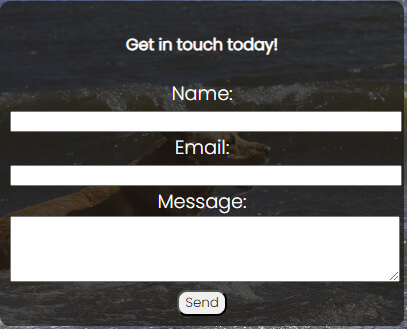
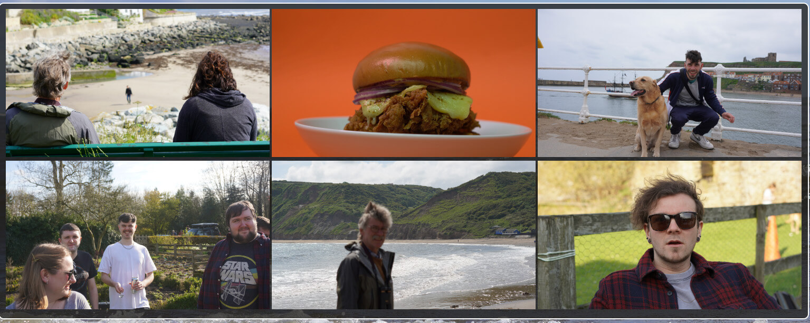

# Winterburn Photography

Winterburn Photography is a website showcasing, recent work by the photographer, giving information about the packages they offer, what work they have recently done shown by a gallery, customer reviews and showing how you can get in touch. In the website the user will learn how to get in touch with the contact page, what equipment can be used and what the results look like with the gallery page, learn what packages are currently on offer with time frames with the amount of hours shown on the page in the package cards and how many photos they can choose to have, on the main index page the user will learn what the website is about and what previous customers have said about their photography experience with Winterburn Photography.

# Features Listed

1. Navigation bar at the top of the webpage, to navigate around the seperate pages on the website.
   
2. permanent footer at the bottom of the page to display the copyright and social media links that open up with seperate tabs using the target \_blank attribute.
   
3. A contact form to get in touch with the company including name, email and message with the form set to required so the user can't send blank messages name or invalid email address. The original structure of the form was borrowed from chat.gpt but the whole styling got changed due to aesthetic not fitting with the webpage. Responsive on different devices, Achieved by media queries.
   
4. A gallery so the user can look at the recent images that the company has produced and encourages the user to have more incentive to get in touch with the company. The gallery is fully responsive on all devices.
   
